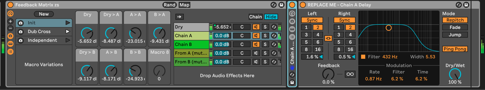
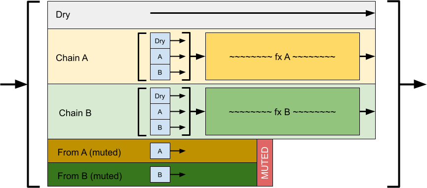

# zs Feedback Matrix

This effect rack device is two independent effects channels (chains) that have complete feedback capability, both per-channel and between channels!

You can put any effects in either chain, and experiment with feedback and cross-feedback.

By default, there is a Delay device in each chain, but they are set to different intervals. This is a good starting point to play with feedback and cross-feedback.

## Installation / Setup

If you just want to download and install the device, then go to the [frozen/](https://github.com/zsteinkamp/zs-Feedback-Matrix/tree/main/frozen) directory and download the newest version there.

### Changelog

* [0.0.1](https://github.com/zsteinkamp/zs-Feedback-Matrix/raw/main/frozen/zs%20Feedback%20Matrix%20v0.0.1.adg) - 2022-05-19 - Initial frozen release.

## Usage

### Custom Effects Chains
Choose `Chain A` or `Chain B` in the main device chain list and replace the delay device that is there, labeled "REPLACE ME".

Make sure you *do not* delete the interior effect rack device that is standing there vertically. That's an essential part of the functionality of the device.

Also, do not unmute the bottom two chains that are labeled `From A (muted)` and `From B (muted)`. These are also critical pieces of how this device is working.

### Preset Snapshots
There are a few preset snapshots to get you started.
* `Init` - Pure dry signal. Click this if things get too loud!
* `Dub Cross` - A fun and mellow cross-feedback setup that's a nice trippy basis.
* `Independent` - The two chains do not feed into one another. They are two independent feedback loops.

### Mapped Controls
The effects rack has 7 mapped knobs.

* `Dry` - This is the level of the dry (unaffected) signal to pass through. It does not affect the input levels to the A or B chains.
* `Dry > A` - This is the level of the dry signal to feed to the A chain.
* `A > A` - This is how much of the A chain should be fed back on itself.
* `B > A` - This is how much of the B chain should be fed to the A chain.
* `Dry > B` - This is the level of the dry signal to feed to the B chain.
* `A > B` - This is how much of the A chain should be fed to the B chain.
* `B > B` - This is how much of the B chain should be fed back on itself.

## What is the big deal?

Normally in Live, you would create a return track and enable its send to itself to create a feedback loop. It's also possible with return tracks to create the same kind of feedback matrix as what this device provides, so there is technically no new capability here.

What you do get though is _locality_ with a sound source that you may only want to use the feedback matrix with. This means you can have the feedback matrix in your instrument chain, or in a group track chain, or even in a return track :). Its automation is then right next to your instrument's automation, and you still have total flexibility around the effects chains you build.

## How does it work?

This device uses a kind-of known hack in Live's devices where you can use the sidechain monitor function of some plugins as an audio teleportation tool.

In this case, we use strategically placed `[Gate]` devices used solely to do this magical audio re-routing. They each have their sidechain input set to the point in the chain they want to tap into, and the blue headphones icon selected which enables monitoring of that signal, blocking anything else.

Each of the effects channels has an audio effects rack that contains three chains, each containing one of the special monitoring `[Gate]`s above. One for the dry signal, one for the output of Chain A, and one for the output of Chain B.

Because a sidechain input can never be that device's chain output (Ableton trying to save us from ourselves), we have to use a little trick on the two appendigal chains to pull the audio down from the end the Chain A so that something in Chain A can tap into it. Same for Chain B.

## Contributing

I'd love to hear from anyone who is using this, or any suggestions or problems you might have with it. Just send me an email! zack@steinkamp.us

## TODO
* ...
